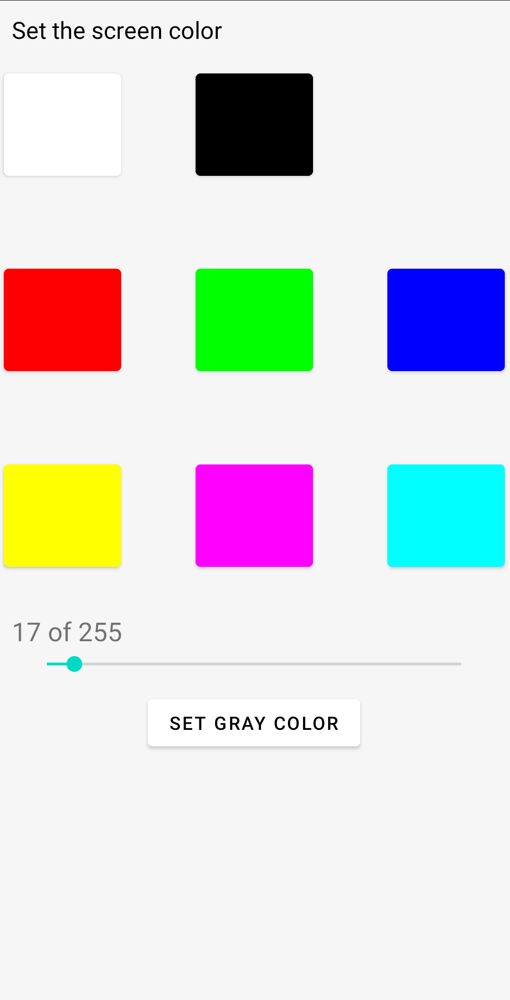

# energy-consumption-screen-test-app
An application for conducting an experiment on the energy consumption of the screen on a test stand

The Application can set whit, black, red, green and blue colors. Also, it can set colors: rgb(255, 255, 0), rgb(255, 0, 255), rgb(0, 255, 255) and all shades of grey. The grey color the is set in the range from 0 to 255.
After pressing the button, the screen changes color to the one you selected and holds it for 10 seconds, after which the application will start showing the main screen - the color selection screen.
